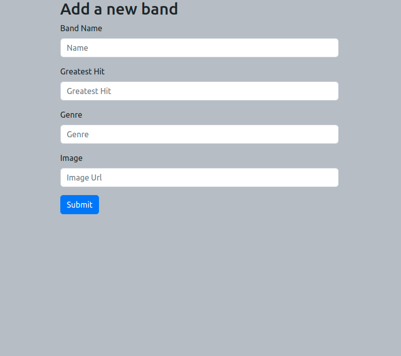
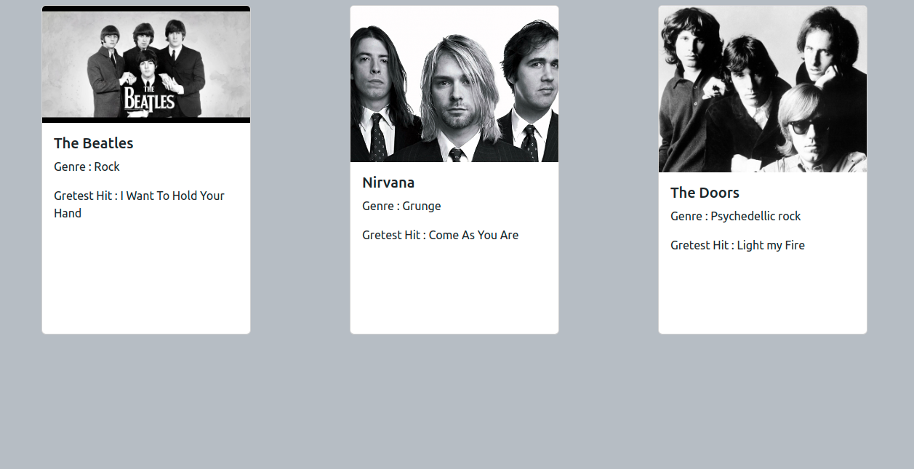
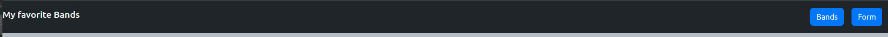

# SPA-props-state-Favorite-bands

## Class components react-application 

## Create an application that the user can add and display their favorite Bands

## tasks : 
   1. Create a react application

   2. Create a Form.js component that contains a form. The user can add Their favorite bands name, greatest hits, genre and an image url.
   Save them in the App.js local state. 
   When the user sumbits the form update your bands state and add the new band. At this point you can also clear your inputs state.

   3. Create a Bands.js component that receives all the bands as props and displays them

   4. Create a Header.js component. Make a navigation with 2 buttons bands and form.
    Depents on what the user clicks display the Form or the Bands Component

 

   5. after the user submits the form display the Bands.js component with the new band included

